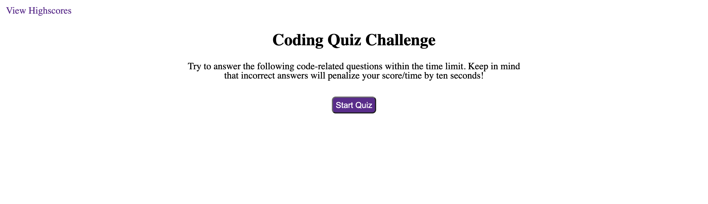
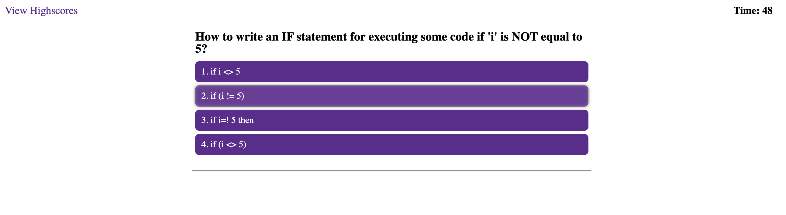
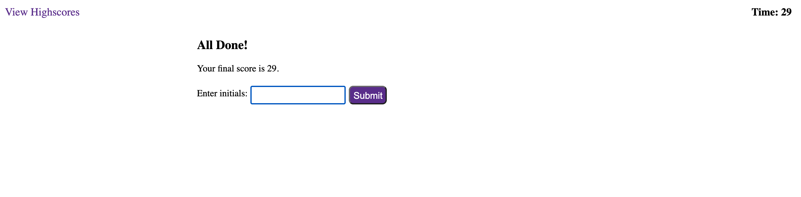
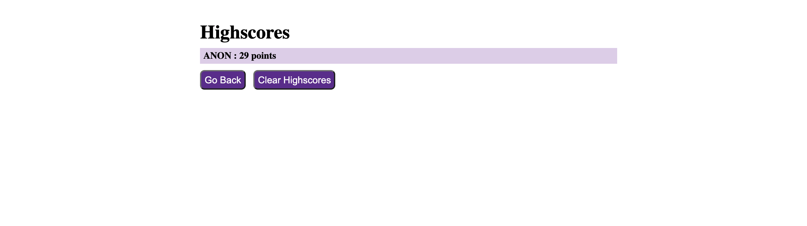

# JavaScript Quiz Challenge

## Description

This application runs a timed coding-assessment quiz about JavaScript fundamentals. It was built in order to test users' knowledge of JavaScript basics by asking them five questions — then storing individual users' highscores (using Local Storage) and ranking them in order to determine user progress. 

## Installation

The quiz has been deployed to a GitHub Pages site (accessible [here](https://msteblu.github.io/CodeQuiz_JS/)), where users can interact with it and quiz themselves.

All of the components of the application are also available through a download and clone. 

## Usage

Navigate to either the deployed [GitHub site](https://msteblu.github.io/CodeQuiz_JS/) or open the index.html file in a browser. From there, users are able to interact by starting the timed quiz, answering the five questions, seeing if they answered correctly or incorrectly, and saving their final score(s).

*Starting the quiz:*

*Answering questions:*

*Saving scores:*

*Highscores Page*

## License 

Licensed under the [MIT](https://github.com/microsoft/vscode/blob/main/LICENSE.txt) license. 